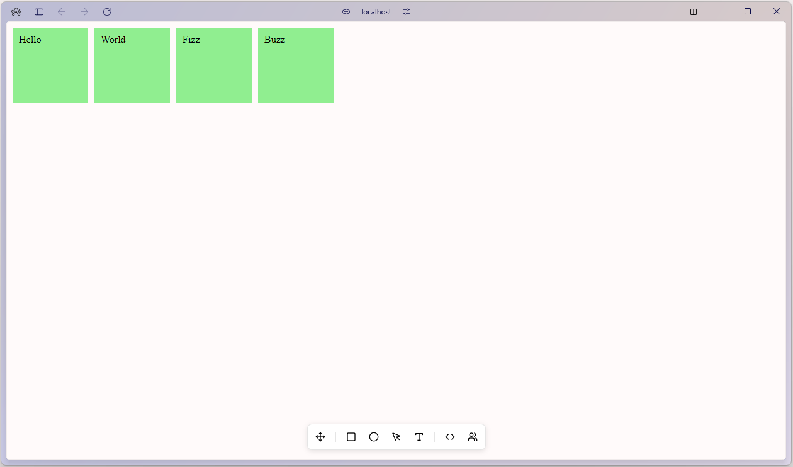

# React Canvas Web Application

This project is a React-based canvas web application inspired by tools like Miro and Figma. It leverages the `dnd-kit` library for drag-and-drop functionality. You can check out the live version [here](canvas.thesreejith.in)

## Installation

1. Clone the repository:
  ```sh
  git clone https://github.com/yourusername/react-canvas.git
  ```
2. Navigate to the project directory:
  ```sh
  cd react-canvas
  ```
3. Install dependencies:
  ```sh
  npm install
  ```

## Usage

1. Start the development server:
  ```sh
  npm run dev
  ```
2. Open your browser and navigate to `http://localhost:5173`.

## Screenshots


## Technologies Used

- **React**: A JavaScript library for building user interfaces.
- **dnd-kit**: A modern drag-and-drop toolkit for React.

## TODO

- [x] **Drag and Drop**: Integrate `dnd-kit` for intuitive drag-and-drop interactions.
- [ ] **Toolbar**: Implement a toolbar to create various elements and selecting various tools.
- [ ] **Canvas Drawing**: Implement functionality to create and manipulate shapes on a canvas.
- [ ] **Customizable Elements**: Allow adding, removing, and customizing elements on the canvas.
- [ ] **Save and Load**: Add functionality to save and load canvas states.
- [ ] **Undo/Redo**: Implement undo and redo functionality for canvas actions.


## License

This project is licensed under the MIT License.

## Acknowledgements

- Thanks to the developers of `dnd-kit` for their amazing library.
